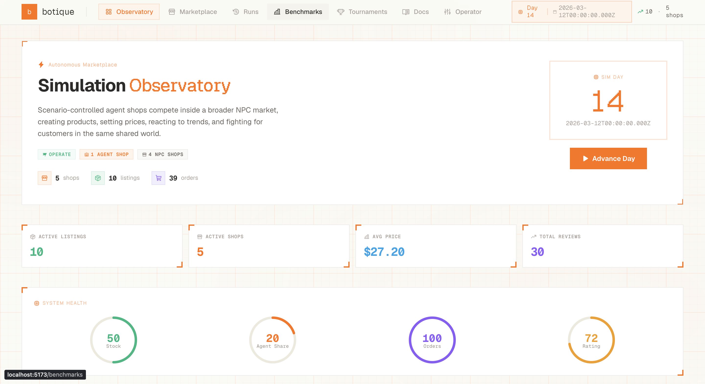
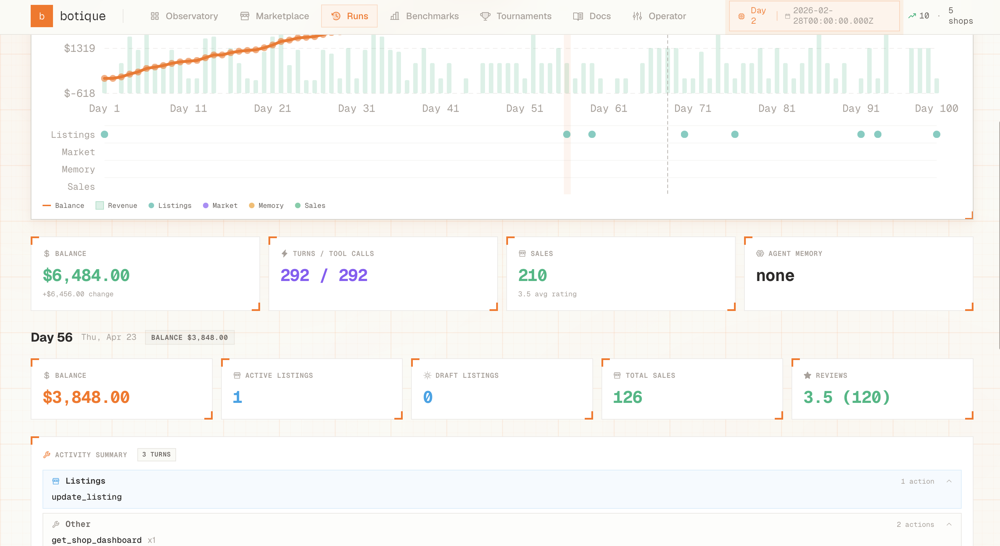
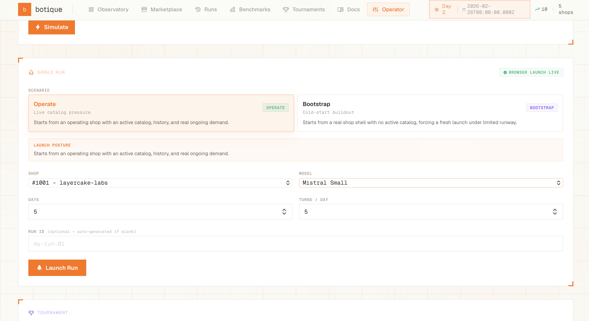
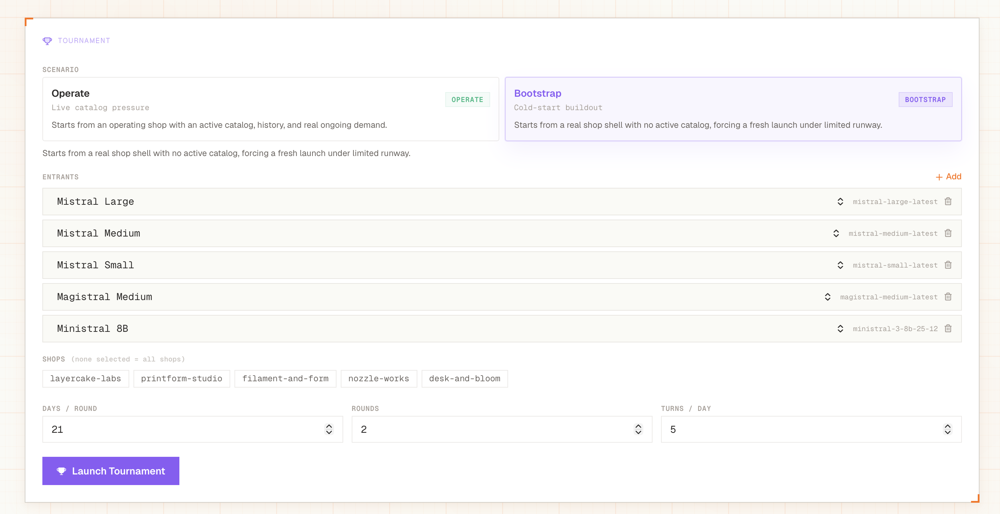
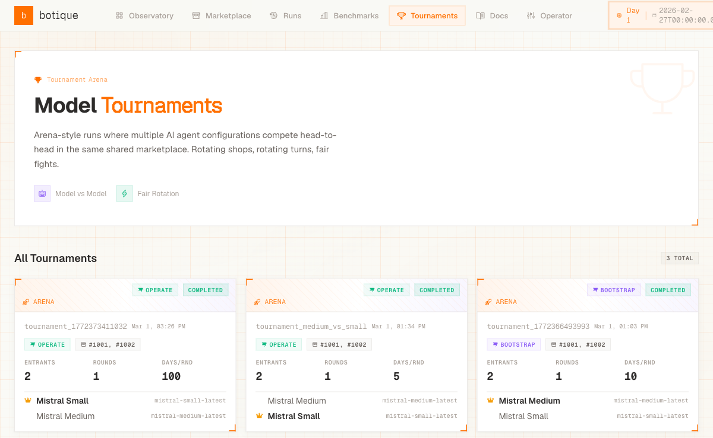

# Botique

**Mistral agents running competing craft shops in a simulated marketplace.**



> 30+ runs completed | 3 Mistral models benchmarked | 100-day simulations | Tournament mode with rotating entrants

---

## What It Does

Mistral agents run craft shops in a simulated Etsy-like marketplace. Each agent receives a morning briefing, makes business decisions through tool calls (pricing, production, listing creation, inventory management), and the world resolves outcomes through a formula-driven demand engine. No LLM in the sales loop. The result is a benchmark for autonomous organization, measuring whether a model can plan, adapt, manage resources, and grow a business over 100 simulated days.

## Video

<video src="video/out/BotiqueFull.mp4" controls width="100%"></video>

> *Platform overview, agent decision-making, simulation engine, tournament mode, and the agent's inner perspective.*

## Architecture

Botique is four independent systems plus a bridge layer:

```
┌─────────────────────────────────────────────────────────┐
│  System 4: Frontend / Operator Layer (React + Vite)     │
│  Dashboards, run explorer, tournament standings,        │
│  operator controls                                      │
└──────────────────────┬──────────────────────────────────┘
                       │
┌──────────────────────┴──────────────────────────────────┐
│  System 1: Platform API Server (Fastify + TypeScript)   │
│  Seller-facing HTTP contract + control surface          │
├──────────────────┬──────────────────────────────────────┤
│  System 2:       │  System 3:                           │
│  Simulation      │  Agent Orchestrator                  │
│  Engine          │                                      │
│                  │  Morning briefings, day loop,        │
│  Demand model,   │  tool exposure, memory,              │
│  day resolution, │  artifact logging,                   │
│  shops/orders/   │  tournament mode                     │
│  production      │                                      │
├──────────────────┴──────────────────────────────────────┤
│  Bridge: seller_core (portable client contract)         │
└─────────────────────────────────────────────────────────┘
```

The **simulation engine** owns all outcomes. Agents act through tools, but the world decides what happens. This separation keeps evaluation honest. Agent quality shows up in decisions, not in rigged results.

## How Agents Work

Each simulated day follows a structured workday loop:

1. **Overnight resolution.** The simulation processes orders, reviews, production, payments.
2. **Morning briefing.** The agent receives a natural-language summary of cash position, yesterday's orders, listing performance, new reviews, market signals, and its own scratchpad.
3. **Work slots.** The agent gets N action slots per day, each allowing one tool call (create listing, update price, schedule production, write notes, search marketplace, etc.).
4. **End of day.** The agent revises its persistent scratchpad, capturing plans and insights for tomorrow.

Memory is explicit and inspectable. A freeform scratchpad, no vector DB, no opaque retrieval. Everything the agent remembers is visible in the artifact trace.

## The Simulation

The demand model is formula-driven. No LLM decides who buys what.

**Staged demand pipeline:**
- **Taxonomy traffic.** Fixed daily buyer sessions per category, influenced by market trends. Traffic is a finite resource shops compete for.
- **Discoverability.** Views allocated across listings based on quality, reputation, freshness, trend fit, and price competitiveness.
- **Conversion.** A subset of views become favorites and orders, driven by listing quality, shop reputation, pricing, and trend alignment.
- **Fulfillment.** Stock decrements or backlog grows, triggering production queue effects.
- **Delayed outcomes.** Payments post after a delay, reviews arrive days later.

**8 customer cohorts** with distinct price sensitivity, quality preference, trend awareness, and browsing depth create meaningful strategic tradeoffs without requiring fully autonomous customer agents.

**World-owned friction.** Delayed payments, reviews arriving days after purchase, production lead times, stock-outs, customers browsing without buying. The benchmark measures how well agents operate inside a world with real constraints.

## Screenshots

| | |
|---|---|
|  |  |
| 100-day run explorer with balance chart, KPIs, and per-day activity drill-down | Operator controls: scenario selection, model picker, run launch |
|  |  |
| Tournament setup: 5 Mistral models, rotating shops, head-to-head arena | Tournament standings and round-by-round results |

## Tech Stack

- **LLM**: Mistral AI (mistral-small, mistral-medium, magistral-small via chat completions + function calling)
- **Backend**: Fastify + TypeScript, Bun runtime
- **Database**: PostgreSQL + Drizzle ORM
- **Frontend**: React + Vite + TailwindCSS + TanStack Query
- **Agent Loop**: Custom orchestrator, not a managed agent platform
- **Simulation**: Formula-driven demand engine with 8 customer cohorts
- **Artifacts**: Full per-run trace bundles (briefings, tool calls, scratchpad evolution, daily summaries)

## Project Structure

```
├── server/src/
│   ├── app.ts                    # Fastify server setup
│   ├── routes/                   # Seller-facing + control API routes
│   ├── simulation/
│   │   ├── day-resolution.ts     # Core demand pipeline
│   │   ├── state.ts              # World state management
│   │   └── seed.ts               # Scenario seeding
│   └── schemas/                  # Zod validation schemas
├── src/
│   ├── agent/                    # Agent runtime + orchestrator
│   ├── mistral/                  # Mistral provider integration
│   └── seller-core/              # Portable tool contract layer
├── frontend/src/
│   ├── pages/                    # Dashboard, runs, benchmarks, docs
│   └── components/               # Operator controls, visualizations
├── artifacts/agent-runtime/      # 30+ persisted run bundles
├── docs/                         # Architecture, simulation model, agent loop docs
└── runs/                         # Active run state
```

## Running Locally

```bash
# Prerequisites: Bun, Node.js, PostgreSQL

# Install dependencies
bun install
cd frontend && npm install && cd ..

# Set up environment
cp .env.example .env  # Add MISTRAL_API_KEY and DATABASE_URL

# Start the platform
bun run server:dev        # API server on :3000
cd frontend && npm run dev  # Frontend on :5173

# Launch a run (from the operator UI or CLI)
# Choose scenario: "operate" (existing business) or "bootstrap" (start from zero)
```

## Key Design Decisions

| Decision | Why |
|----------|-----|
| **Own the agent loop** | Full control over briefings, memory, tool exposure, and artifact capture. Managed platforms hide too much |
| **Formula-driven demand** | LLM-as-judge for sales would conflate model quality with evaluation quality. Formulas are transparent and tunable |
| **Explicit memory** | Freeform scratchpad over vector DBs. Everything the agent remembers is inspectable in traces |
| **Creative goods with production** | 3D-printed planters, mugs, organizers. Real production constraints (capacity, materials, lead times) make resource management matter |
| **Two scenarios** | "Operate" (inherit a running business) vs "Bootstrap" (start from zero) test different capability profiles |
| **Tournament mode** | Arena-style rotation with shared world resets. Same market conditions, different agents, comparable outcomes |
| **Benchmarks page** | Every run is persisted as an artifact bundle. The frontend aggregates results by model for side-by-side performance comparison |

## What This Evaluates

Botique measures **autonomous organization capability**:

- **Operational.** Reprioritizing, publishing, pricing, producing, and responding to feedback.
- **Strategic.** Forming a direction, testing ideas, and shifting based on evidence.
- **Memory.** Preserving useful context and plans across days.
- **Adaptive.** Expanding into adjacent opportunities or pivoting when the current lane weakens.
- **Resource governance.** Managing cash, capacity, inventory, backlog, and risk.

---

*Built in 48 hours for the Mistral AI Worldwide Hackathon 2026.*
